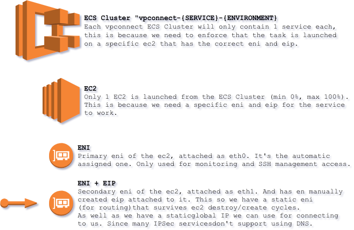

# VPConnect

Small dockerized IPSec server with focus on supporting routing to dynamic resources, vpc peering and security.  

## Overview

VPConnect is based on `alpine:3.7` linux and `strongswan:5.7.1`. The resulting image is less than 300mb in size.

The system will run just fine on a `t2.nano` in most use cases.  
So if you run it as a reserved instance for 3 years it will cost you around $1,5/month (excluding data transfer costs).

Please refer to the Example at the bottom of this page for an step by step example of how to create a new VPN service.

## Features

- You can have a wide SA and limit accessed by iptables rules and/or SG ingress rules.
- Iptables rules can be based on hostname and will be automatically updated when IP of the resource changes (good for load balancers!).
- Masquerade specific subnets/ips/rules, allowing traffic to traverse VPC Peering connections to different regions/accounts.
- Static interface and elastic IP that survives ec2 teardown and creation, allowing route entries that don't need to be changed when ec2 is rotated or updating/changing IP on service on the other end.
- Extensive logging of both the vpconnect service with warning and errors, charon logging, new INPUT and FORWARD connections and ec2 security and health logs to CloudWatch logs.
- ECS will automatically launch a new ec2 if the previous one fails, and attaches the correct network interface and eip.
- Docker based so you can easily try out new versions and easily roll-back to previous version.
- Good security, "bad" security, integrity and dh aglos/groups are not included in the minimal strongswan build (see below).
- Encrypts PSK password in global region using KMS. So PSK not stored anywhere in clear text **.
  ** Will be stored in clear text if region=china, due to KMS missing not yet released in china.
- Supports multiple right endpoints / connections.

## Note on instance types

*not tested*

Some instance types don't use the ethX naming schema for network interfaces and are probably not supported by the
attach / detach interface commands. However this has not been tested. The following instance types have been tested
and works.

- t2
- c4
- c5

Known instance types that doesn't work

- m

## Diagram



## Supported Configuration

```text
VPN Types
[x] Subnet-2-Subnet
[ ] Virtual Network

Security Associations
[x] IKEv1
[x] IKEv2

Authentication
[ ] Public Key Authentication (Certificates)
[x] PSK (Pre-Shared Key)
[ ] EAP (Extensible Authentication Protocol)
[ ] XAuth (eXtended Authentication)

Encryption Algorithms
[ ] 3des (168 bit 3DES-EDE-CBC)
[ ] cast128 (128 bit CAST-CBC)
[ ] blowfish128 / blowfish (128 bit Blowfish-CBC)
[ ] blowfish192 (192 bit Blowfish-CBC)
[ ] blowfish256 (256 bit Blowfish-CBC)
[ ] null (Null encryption)
[x] aes / aes128 (128 bit AES-CBC)
[x] aes192 (192 bit AES-CBC)
[x] aes256 (256 bit AES-CBC)
[x] aes128ctr (128 bit AES-COUNTER)
[x] aes192ctr (192 bit AES-COUNTER)
[x] aes256ctr (256 bit AES-COUNTER)
[x] aes128ccm8 / aes128ccm64 (128 bit AES-CCM with 64 bit ICV)
[x] aes192ccm8 / aes192ccm64 (192 bit AES-CCM with 64 bit ICV)
[x] aes256ccm8 / aes256ccm64 (256 bit AES-CCM with 64 bit ICV)
[x] aes128ccm12 / aes128ccm96 (128 bit AES-CCM with 96 bit ICV)
[x] aes192ccm12 / aes192ccm96 (192 bit AES-CCM with 96 bit ICV)
[x] aes256ccm12 / aes256ccm96 (256 bit AES-CCM with 96 bit ICV)
[x] aes128ccm16 / aes128ccm128 (128 bit AES-CCM with 128 bit ICV)
[x] aes192ccm16 / aes192ccm128 (192 bit AES-CCM with 128 bit ICV)
[x] aes256ccm16 / aes256ccm128 (256 bit AES-CCM with 128 bit ICV)
[x] aes128gcm8 / aes128gcm64 (128 bit AES-GCM with 64 bit ICV)
[x] aes192gcm8 / aes192gcm64 (192 bit AES-GCM with 64 bit ICV)
[x] aes256gcm8 / aes256gcm64 (256 bit AES-GCM with 64 bit ICV)
[x] aes128gcm12 / aes128gcm96 (128 bit AES-GCM with 96 bit ICV)
[x] aes192gcm12 / aes192gcm96 (192 bit AES-GCM with 96 bit ICV)
[x] aes256gcm12 / aes256gcm96 (256 bit AES-GCM with 96 bit ICV)
[x] aes128gcm16 / aes128gcm128 (128 bit AES-GCM with 128 bit ICV)
[x] aes192gcm16 / aes192gcm128 (192 bit AES-GCM with 128 bit ICV)
[ ] aes128gmac (Null encryption with 128 bit AES-GMAC)
[ ] aes192gmac (Null encryption with 192 bit AES-GMAC)
[ ] aes256gmac (Null encryption with 256 bit AES-GMAC)
[ ] camellia128 / camellia (128 bit Camellia-CBC)
[ ] camellia192 (192 bit Camellia-CBC)
[ ] camellia256 (256 bit Camellia-CBC)
[ ] camellia128ctr (128 bit Camellia-COUNTER)
[ ] camellia192ctr (192 bit Camellia-COUNTER)
[ ] camellia256ctr (256 bit Camellia-COUNTER)
[ ] camellia128ccm8 / camellia128ccm64 (128 bit Camellia-CCM with 64 bit ICV)
[ ] camellia192ccm8 / camellia192ccm64 (192 bit Camellia-CCM with 64 bit ICV)
[ ] camellia256ccm8 / camellia256ccm64 (256 bit Camellia-CCM with 64 bit ICV)
[ ] camellia128ccm12 / camellia128ccm96 (128 bit Camellia-CCM with 96 bit ICV)
[ ] camellia192ccm12 / camellia192ccm96 (192 bit Camellia-CCM with 96 bit ICV)
[ ] camellia256ccm12 / camellia256ccm96 (256 bit Camellia-CCM with 96 bit ICV)
[ ] camellia128ccm16 / camellia128ccm128 (128 bit Camellia-CCM with 128 bit ICV)
[ ] camellia192ccm16 / camellia192ccm128 (192 bit Camellia-CCM with 128 bit ICV)
[ ] camellia256ccm16 / camellia256ccm128 (256 bit Camellia-CCM with 128 bit ICV)
[ ] chacha20poly1305 (256 bit ChaCha20/Poly1305 with 128 bit ICV)

Integrity Algorithms
[ ] md5 (MD5 HMAC)
[ ] md5_128 (MD5_128 HMAC)
[x] sha1 / sha (SHA1 HMAC)
[ ] sha1_160 (SHA1_160 HMAC)
[x] aesxcbc (AES XCBC)
[x] aescmac (AES CMAC)
[ ] aes128gmac (128-bit AES-GMAC)
[ ] aes192gmac (192-bit AES-GMAC)
[ ] aes256gmac (256-bit AES-GMAC)
[x] sha256 / sha2_256 (SHA2_256_128 HMAC)
[x] sha384 / sha2_384 (SHA2_384_192 HMAC)
[x] sha512 / sha2_512 (SHA2_512_256 HMAC)
[ ] sha256_96 / sha2_256_96 (SHA2_256_96 HMAC)

DH Groups
[ ] DH Group 1  (768-bit regular group)
[ ] DH Group 2  (1024-bit regular group)
[x] DH Group 5  (1536-bit regular group)
[x] DH Group 14 (2048-bit regular group)
[x] DH Group 15 (3072-bit regular group)
[x] DH Group 16 (4096-bit regular group)
[x] DH Group 17 (6144-bit regular group)
[x] DH Group 18 (8192-bit regular group)
[x] DH Group 19 (256-bit nist elliptic group)
[x] DH Group 20 (384-bit nist elliptic group)
[x] DH Group 21 (521-bit nist elliptic group)
[ ] DH Group 22 (1024-bit modulo prime group)
[ ] DH Group 23 (2048-bit modulo prime group)
[ ] DH Group 24 (2047-bit modulo prime group)
[x] DH Group 25 (192-bit nist elliptic group)
[x] DH Group 26 (224-bit nist elliptic group)
[x] DH Group 27 (224-bit brainpool elliptic group)
[x] DH Group 28 (256-bit brainpool elliptic group)
[x] DH Group 29 (384-bit brainpool elliptic group)
[x] DH Group 30 (512-bit brainpool elliptic group)
[ ] DH Group 31 (256-bit elliptic curve25519/x25519)
```

## Requirements

You will need to have the following dependencies installed to build and deploy VPConnect.

- docker [https://www.docker.com/](https://www.docker.com/)
- awscli [https://aws.amazon.com/cli/](https://aws.amazon.com/cli/)

Docker is used when building the Go program, creating a new service and generating the CF template.  
AWS CLI is used when deploying to AWS.

### Necessary Environment variables (or variables passed to make)

```text
AWS_PROFILE   The AWS profile to use for deploying the service as well as pushing the docker image.
AWS_REGION    The AWS Region to deploy the service and where ECR is located, eg. "eu-west-1".
OWNER         The OWNER of the service, this is just used for tagging purposes.
REPO          The ECR repo to push the docker images to. This is only required when building the docker image.
```

## Creating a new service (VPN Server)

```bash
make new SERVICE=<NAME> ENVIRONMENT=<ENV> REGION=<REGION>
```

Where `<NAME>` is the name of the service you want to create. (example: `myservice`).  
`<ENV>` is the environment of the service. (example: `prod`).  
And `<REGION>` is either global or china, this because the template and setup differs between
global and china, due to the lack of KMS support in china region.

Both `<NAME>` and `<ENV>` should only contain `lower case alphanumeric` characters as well as `"-"` characters.  
`<REGION>` can be either lower case or upper case.

When a new service has been generated the following configuration file will have been generated.  

```text
services/<NAME>-<ENV>/config.yaml       The main configuration file. Please edit this and not any CF template directly.
```

The file will look like this:

```yaml
FriendlyName: ""
Name: testService
Environment: dev
Region: global
Network:
  VpcId: ""
  PrivateSubnetId: ""
  PublicSubnetId: ""
Ecs:
  InstanceType: t2.nano
  Memory: 384
  DockerImage: ""
  SshKeyName: ""
  KmsKeyArn: ""
  AlarmSnsArn: ""
  AmiImageId: ""
Config:
  Connections:
  - Name: ""
    Type: subnet
    IkeVersion: 2
    PskEncrypted: ""
    Psk: ""
    Encryption: aes256
    Integrity: sha256
    DiffieHellman: modp2048
    IkeLifeTime: 10800
    IpsecLifeTime: 3600
    Local:
      Subnets: []
    Remotes: []
  Rules: []
  CheckInterval: 300
Debug: false
Ingress: []
```

### Config Parameters

| Name | Description | Default | Required |
| - | - | - | - |
| FriendlyName | Friendly name used in descriptions etc. Can be spaces, upper case letters and so on. | | Yes |
| Name | The name for the service, used in naming resources. Must be lower case alphanumeric characters. | | Yes |
| Debug | If the vpconnect program should start in debug mode. Very noisy! | false | No |
| Environment | The environment it's deployed to. prod, staging, test, dev etc. | | Yes |
| Region  | Either global or china. | | Yes |
| Network.VpcId | The VPC ID the service should be deployed to. | | Yes |
| Network.PrivateSubnetId | The Subnet ID for the private network interface (used monitoring/internally). Only 1 subnet is supported. | | Yes |
| Network.PublicSubnetId  | The Subnet ID for the public network interface. Must be a public subnet and be in the same AZ as the Private subnet. Only 1 subnet is supported. | | Yes |
| Ecs.InstanceType | The Instance Type to use for the ECS cluster. t3.nano default for global, t2.nano for china. | t3/t2.nano | No |
| Ecs.Memory | The amount of memory to reserve for the service. Should correspond to something valid depending on Instance Type. | 384 | No |
| Ecs.DockerImage | What repo and docker image to use for the service. | | Yes |
| Ecs.SshKeyName | What root key to launch the instance with. | | Yes |
| Ecs.KmsKeyArn | KMS Key ARN used to decrypt the PSK SSM Parameter. This Key must have been added with a Key policy for the whole AWS account. Otherwise the policy for allowing decrypt added by this services CF will not be enough to use it. Please see [https://amzn.to/2Ox81e0](https://amzn.to/2Ox81e0) | | Yes for global |
| Ecs.AlarmSnsArn | What SNS topic ARN to send any alarms to. | | Yes |
| Ecs.AmiImageId  | What AMI Image ID to use for instances. This setting will be ignored if region is global. | | Yes for china |
| Config.CheckInterval | The number of seconds between checking DNS addresses in rules. Should try and match DNS TTL of the entries. | 300 | No |
| Config.Connections.Name | The name of the connection. | | Yes |
| Config.Connections.Type | What kind of VPN service to setup. | subnet | No |
| Config.Connections.IkeVersion | The IKE version Charon should run as (Either 1 or 2)  | 2 | No |
| Config.Connections.PskEncrypted | The encrypted PSK value. Should be encrypted by the key specified in Ecs.KmsKeyArn. Otherwise decryption might fail. |  | Yes for global |
| Config.Connections.Psk | The unencrypted PSK value. Should only be used in china region. This setting will be ignored if region is global. | | Yes for china |
| Config.Connections.Local.Subnets | List of subnets on the left/local side. Write subnets with CIDR notation. (example 192.168.0.0/24). | | Yes |
| Config.Connections.Remotes.Name | Remote Name. | | Yes |
| Config.Connections.Remotes.Ip | Remote IP for the right side. | | Yes |
| Config.Connections.Remotes.Id | Remote ID for the right side. | Same as Ip | No |
| Config.Connections.Remotes.Subnets | List of subnets on the right/remote side. Write subnets with CIDR notation. (example 192.168.0.0/24) | | Yes |
| Config.Connections.Encryption | The Encryption algorithm to use. | aes256 | No |
| Config.Connections.Integrity | The Integrity algorithm to use. | sha256 | No |
| Config.Connections.DiffieHellman | The Diffie Hellman group to use. | modp2048 | No |
| Config.Connections.IkeLifeTime | The IKE/Phase 1 lifetime in seconds. | 10800 | No |
| Config.Connections.IpsecLifeTime | The IPSec/Phase 2 lifetime in seconds. | 3600 | No |
| Config.Rules | List of rules | | Yes |
| Ingress | Manual SG Ingress rule on the Public Interface. Only the WAN IP (primary and secondary) are opened on UDP/500 + 4500 automatically. Any local subnets/SGs that need to be able to use the VPN service needs to be added as well. | | No |

Fill in the empty values according to your specification before attempting to run later steps.

## Rules Configuration

Rules are used for creating iptables rules allowing traffic to and from left and right side.  
Per default everything is blocked, so if you have no rules it will not be possible to generate the cf file.
Because if rules are empty this service serves no purpose :)

```yaml
- From: [ "172.0.0.0/24", "host.hej.com" ]
  To: [ "192.168.1.0/24" ]
  Ports: [ 443, 8080 ]
  Protocols: [ "tcp" ]
  Masq: false
```

### Rules parameters

```text
From         List of CIDR or hostnames. If /MASK is omitted it defaults to /32.
To           List of CIDR or hostnames. If /MASK is omitted it defaults to /32.
Ports        List of ports to allow between From and To destinations.
             Allowed values are between 1 and 65535 and -1 for all ports.
Protocols    Protocols to allow. Valid values are tcp, udp, icmp and -1 (for all protocols).
Masq         If we should use Masquerading on the traffic between From and To.
             This is required if you want to pass the traffic through an AWS VPC Peering connection.
             Valid values are true or false. If omitted defaults to false.
             If set to true a POSTROUTING rule for masquerading the traffic will be added in addition
             to the normal FORWARD rule.
```

## Ingress Configuration

Ingress can be used to allow manual ingress rules on the public network interface security group.  
This is needed to allow local subnets to connect to/through the VPN tunnel as these are not added
automatically.

For possible parameters see SecurityGroupIngress CloudFormation YAML.  
All supported parameters from Amazon, such as using SecurityGroup, Network ranges etc are supported.

[https://docs.aws.amazon.com/AWSCloudFormation/latest/UserGuide/aws-properties-ec2-security-group-ingress.html](https://docs.aws.amazon.com/AWSCloudFormation/latest/UserGuide/aws-properties-ec2-security-group-ingress.html)

## Generating CF template (optional)

This is optional in the sense that this step is always run when running `make deploy`.  
But can be good if you want to review the automatically generated CF file before deploying (code review, etc)

```bash
make gen SERVICE=<NAME> ENVIRONMENT=<ENV>
```

## Deploying service

```bash
make deploy SERVICE=<NAME> ENVIRONMENT=<ENV>
```

## Base template used for generating CF

The base template is located in `cf-template.yaml` for global.  
And `cf-template-cn.yaml` for china.

## Changing default values for service creation

The defaults for when a service is created can be modified by changing the def map in
`service-gen/defaults.go`

## Changing / Building the Docker Image

Make the changes to the docker image you want to do.  
Making docker will also trigger `go-build`, `docker-build` and `docker-push`.

```bash
make docker
```

## Logging

The service does a lot of logging. Everything is logged to cloudwatch under the following log groups.  
Base Path of all `vpconnect` services in CloudWatch logs are `/vpconnect/<NAME>-<ENV>/<LOG>` where `<LOG>`
is one of the following

```text
secure        /var/log/secure (from ec2)
dmesg         /var/log/dmesg (from ec2)
messages      /var/log/messages (from ec2)
docker        /var/log/docker (from ec2)
ecs-init      /var/log/ecs/ecs-init (from ec2)
ecs-agent     /var/log/ecs/agent (from ec2)
ecs-audit     /var/log/ecs/audit.log* (from ec2)
iptables      Logging New connections (from ec2)
charon        Charon log from strongswan (from docker via ec2 (mounted file))
vpconnect     The vpconnect program logging (from awslogs docker driver)
```

## Alarms

The service has the following CloudWatch Alarms, if an alarm in triggered it will be sent to the specified AlarmSns in the config file.

```text
CPU alarm        >90%
Memory alarm     >95%
Swap alarm       >50%
Disk alarm       >90%
EC2 Health Check alarm
```

## Storing services

You should store the services file in a separate repo.  
For this the services folder is ignored by gitignore, so just create a new repo inside the services file
and push/pull changes to your own private repo for that.

## Routing

You will probably need to add routes to your route tables if you're planning on allowing
traffic from AWS to the remote site. (Routing not needed for other way if you're using the Masquerade option).

You simple just add a route for the specific CIDR to the eni created. This eni will survive ec2 termination/recycle.

## Example (step-by-step)

The following steps will explain how to generate a new VPConnect service.
We will pretend to be connecting our datacenter to our warehouse.

It will create two VPN tunnels, one primary and one secondary.
The primary WAN ip will be 213.111.111.100 and the secondary will be
213.222.222.100.

The local (left) subnets are `10.10.10.0/24` and `10.20.20.0/24` and the remote (right) subnets are `192.168.100.0/24` and `192.168.200.0/24`.

In iptables (RULES) we will limit so that the warehouse can access the IP corresponding to my.aws.service.com over tcp/443.  
All other ports (and traffic in other direction) will be denied.

If my.aws.service.com changes IP the service will automatically update the iptables rule.

### Create the base template

```bash
make new SERVICE=test ENVIRONMENT=dev REGION=global
```

### Edit the config file

Edit the config file under `services/test-dev/config.yaml` to fit your needs.  
Check the parameters above for what must be set and not.

See the following example config.

```yaml
# Allow traffic from our warehouse, 192.168.100.0/24 and 192.168.200.0/24
# to the IP that corresponds to my.aws.service.com (is in 10.10.10.0/24
# or 10.20.20.0/24 in this example). Only traffic on port tcp/443 will
# be allowed.
# Masquerading will not be enabled.
# All other incoming or outgoing traffic will be blocked.

# As you will see in the ingress rules (the AWS SG rules) we allow all
# traffic over all protocols from 192.168.100+200.0/24 and then limit
# by iptables.

# In a real world scenario you would probably want this as tight as
# possible regarding sources, protocols and ports.

# For example limiting tcp/443 to the whole subnet that an load balancer
# with none static IP is in. And then add the DNS hostname of the load
# balancer to the Rules list so that we can block all traffic except
# to to the load balancer.

FriendlyName: Test
Name: test
Environment: dev
Region: global
Network:
  VpcId: vpc-12345678
  PrivateSubnetId: subnet-87654321
  PublicSubnetId: subnet-12345678

Ecs:
  InstanceType: t2.nano
  Memory: 384
  DockerImage: my.ecr.repo.com/vpconnect:my-image-tag
  SshKeyName: my-key
  KmsKeyArn: arn:aws:kms:MyRegion:MyAccountId:key/My-KmsKey-Id
  AlarmSnsArn: arn:aws:sns:MyRegion:MyAccountId:MySNS

Config:
  Connections:
    - Name: warehouse
      Type: subnet
      IkeVersion: 2
      PskEncrypted: MYENCRYPTIONHASH
      Encryption: aes256
      Integrity: sha256
      DiffieHellman: modp2048
      IkeLifeTime: 10800
      IpsecLifeTime: 3600

      Local:
        Subnets: [ 10.10.10.0/24, 10.20.20.0/24 ]

      Remotes:
        - Name: primary
          Ip: 213.111.111.100
          Subnets: [ 192.168.100.0/24, 192.168.200.0/24 ]

        - Name: secondary
          Ip: 213.222.222.100
          Subnets: [ 192.168.100.0/24, 192.168.200.0/24 ]

  Rules:
    - From: [ 192.168.100.0/24, 192.168.200.0/24 ]
      To: [ my.aws.service.com ]
      Ports: [ 443 ]
      Protocols: [ tcp ]
      Masq: false

  CheckInterval: 300

Debug: false

Ingress:
  - CidrIp: 192.168.100.0/24
    Description: Allow warehouse series 1
    FromPort: -1
    ToPort: -1
    IpProtocol: -1
  - CidrIp: 192.168.200.0/24
    Description: Allow warehouse series 1
    FromPort: -1
    ToPort: -1
    IpProtocol: -1
```

### Deploy it

Deploy it, please be sure that you are authed and have the correct AWS_PROFILE set.

```bash
make deploy SERVICE=test ENVIRONMENT=dev
```

You can see how the generated template looks like by checking out `services/<NAME>-<ENV>/cf.yaml`.